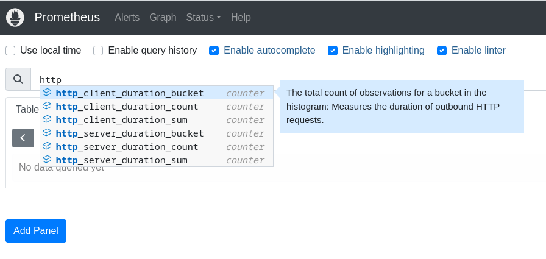

# How to use the OpenTelemetry `sdk-node` for automatic metrics with a Basic Express application

## Create a project

```shell
mkdir example
npm init -y
```

## Install the required dependencies

```shell
npm @opentelemetry/api \
@opentelemetry/exporter-metrics-otlp-http \
@opentelemetry/sdk-node \
@opentelemetry/instrumentation-express \
@opentelemetry/instrumentation-http \
@opentelemetry/resources \
@opentelemetry/semantic-conventions \
express
```

## Use this code for automatic metrics provided by `sdk-node`

Create a file `otel.ts`

```ts
import { diag, DiagConsoleLogger, DiagLogLevel } from '@opentelemetry/api';

import { NodeSDK, metrics } from '@opentelemetry/sdk-node';
import { error } from 'console';
import { Resource } from '@opentelemetry/resources';
import { ExpressInstrumentation } from '@opentelemetry/instrumentation-express';
import { HttpInstrumentation } from '@opentelemetry/instrumentation-http';
import { SemanticResourceAttributes } from '@opentelemetry/semantic-conventions';
import { OTLPMetricExporter } from '@opentelemetry/exporter-metrics-otlp-http';

diag.setLogger(new DiagConsoleLogger(), DiagLogLevel.DEBUG);

const resource = new Resource({
  [SemanticResourceAttributes.SERVICE_NAME]: process.env.npm_package_name,
});

const metricsExporter = new OTLPMetricExporter();

const sdk = new NodeSDK({
  metricReader: new metrics.PeriodicExportingMetricReader({
    exporter: metricsExporter,
    exportIntervalMillis: 3000,
  }),
  autoDetectResources: true,
  resource: resource,
  instrumentations: [new HttpInstrumentation(), new ExpressInstrumentation()],
});

try {
  sdk.start();
} catch (err) {
  error(err);
}
```

## Note

For some reason we need the following packages, which, according to the documentation they are supposed to be used when looking for Traces. If we remove them, we can't see the default metrics being generated.

```ts
import { ExpressInstrumentation } from '@opentelemetry/instrumentation-express';
import { HttpInstrumentation } from '@opentelemetry/instrumentation-http';
```

## Update the package.json to start the sdk

```json
"scripts": {
  "start": "NODE_OPTIONS='--require ./dist/otel.js' node dist/server.js",
}
```

## Run this example

```shell
git clone https://github.com/obs-nebula/gamma-ray.git
cd gamma-ray/metrics/01
npm install
npm run build
npm start
```

Open a new terminal and run

```shell
podman-compose up
```

Open a new terminal and run a few times

```shell
curl localhost:8080
```

Go to prometheus to see the metrics


