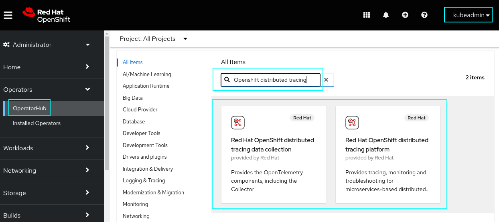

# How to install OTELCOL Operator and Jaeger Operator from OpenShift Distributed Tracing Platform

## Download OpenShift Local

[Go to releases and follow the instructions](https://github.com/crc-org/crc/releases)

## Install the OpenShift Distributed Tracing Platform Operator and the OpenShift Distributed Tracing Platform Data Collector Operator

1. Login as `kubeadmin`
2. Go to OperatorHub
3. Search for `Openshift distributed tracing`
4. Install both following the instructions.

